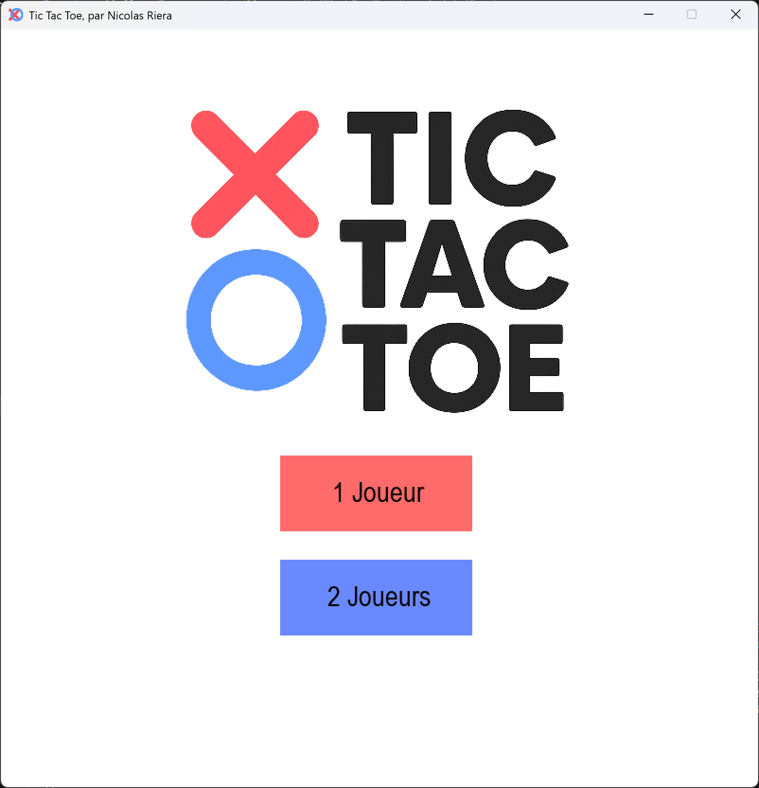
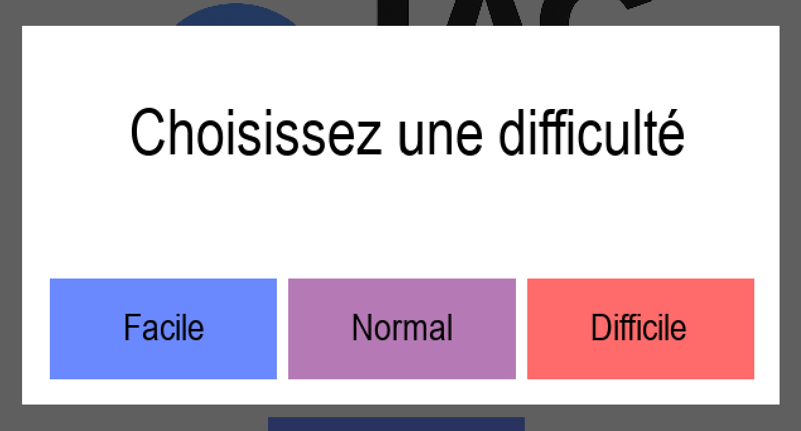

# Tic Tac Toe

Un Morpion simple développé en Python, jouable en mode console ou en graphique.
Le jeu propose un mode un joueur contre l’ordinateur ainsi qu’un mode deux joueurs. L’IA propose trois niveaux de difficulté pour adapter le challenge.

---

## Fonctionnalités

### Modes de jeu :
- **1 joueur** : affrontez l’ordinateur.
- **2 joueurs** : affrontez un ami sur le même ordinateur.

### Niveaux de difficulté de l’IA :
- **Facile** : l’ordinateur joue de manière aléatoire.
- **Normal** : l’ordinateur tente de gagner si possible et bloque le joueur si nécessaire, sinon joue au hasard.
- **Difficile** : l’ordinateur joue parfaitement grâce à l’algorithme Minimax, il ne peut jamais perdre.

### Interface console simple et claire :
- Plateau de jeu affiché avec numéros pour les cases vides.
- Affichage des symboles `"X"` et `"O"`.
- Notification des victoires, défaites ou égalités.

### Rejouer facilement après chaque partie.

---

## Installation

1. Clonez le dépôt :

`git clone https://github.com/nicolas-riera/TicTacToe.git`

2. Rendez-vous dans le dossier du projet :

`cd TicTacToe`

3. Lancez le jeu avec Python 3 :

`python main.py`

--- 

## Comment jouer

1. Sélectionnez le mode de jeu dans le menu principal (1 ou 2 joueurs).
2. Choisissez votre symbole si nécessaire et votre niveau de difficulté contre l’IA.
3. Pour jouer, entrez le numéro de la case (1 à 9) où vous voulez placer votre symbole.
4. Le jeu détecte automatiquement la victoire, la défaite ou l’égalité et vous propose de rejouer.

---

## Algorithmes de l’IA
- **Facile** : choix aléatoire parmi les cases libres.
- **Normal** : logique simple pour gagner ou bloquer le joueur.
- **Difficile** : l’algorithme Minimax permet à l’ordinateur de simuler tous les coups possibles et choisir le meilleur, assurant une stratégie parfaite.
